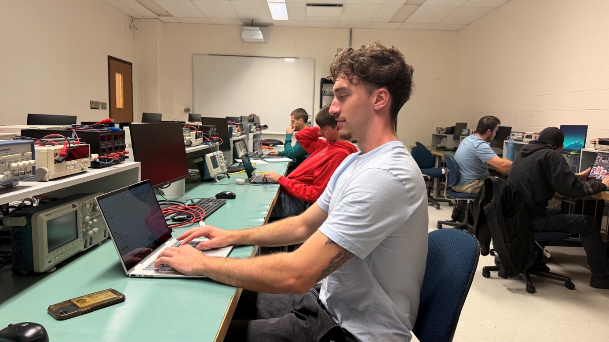

# TEST D'INTÉGRATION

**contenu:**

Slide::

## 1. Test Zach

Ceci est un test de la fonction de Zach.

!! . 2

Slide::

## 2. Test Amé

Ceci est un test de la checklist.

=Faire le code
+Tester le programme
+Faire la documentation

Slide::

## 3. Test Jay

Ceci est un test du texte centré.

()

Voici un texte qui devrait être centré.

()

()
This is a () test
()

This text should not be centered

Slide::

## 4. Test Antoine

Ceci est un test des couleurs.

{{red|Texte rouge}}

{{blue|Texte bleu}}

{{=yellow|Texte avec un fond jaune}}

{{red,=yellow|Texte rouge avec un fond jaune}}

Slide::

## 5. Test ensemble

Cette slide teste les fonctions qui fonctionnent ensemble.

Voici du {{red|texte rouge}} dans la même slide.

()

Ce texte devrait être centré.

()

///Tâche 1
///Tâche 2
///Tâche 3

Voici encore du {{blue|texte bleu}}.
Slide::
## 6. Test Will

@@@
src: Libra.jpeg
width: 500px
height: 500px
margin-left: 50px
margin-top: 20px
border-radius: 10px
alt: texte alternatif ici
@@@

Slide::

@@@
src: https://media3.giphy.com/media/v1.Y2lkPTc5MGI3NjExYm5qMnF1ZW5wcTZtb2dqOXMxb3Mwa3J4YXpwdGtvYTRxOWkyNHB0biZlcD12MV9pbnRlcm5hbF9naWZfYnlfaWQmY3Q9Zw/tR9Si4uQqcHcseVOZN/giphy.gif
width: 400px
height: 500px
margin-left: 50px
margin-top: 20px
border-radius: 10px
alt: texte alternatif ici
@@@

<!-- SAID_START -->

Slide::

## 7. Test Said

# Mon document

## Introduction

Ceci est un texte normal.

**Ceci est en gras.**

*Ceci est en italique*

***Ceci est en ******italique******&******Gras******.***

### Ma liste :

• Pomme

• Banane

• Orange

### Ma liste numérotée :

1. Étape un

2. Étape deux

3. Étape trois

4. Étape quatre

Mon tableau :

| Dembele | Griezman | Ronaldo | Barcola |
| --- | --- | --- | --- |
| Vitinha | Veratti | Mazadona | Zaire-emery |
| Hakimi | mendes | marquinhos | Ramos |

### Mon lien :

[https://cegepsherbrooke.qc.ca/](https://cegepsherbrooke.qc.ca/)

Slide::

## 8. Test Bruno

Ligne 01  
Ligne 02  
Ligne 03  
Ligne 04  
Ligne 05  
Ligne 06  
Ligne 07  
Ligne 08  
Ligne 09  
Ligne 10  
Ligne 11  
Ligne 12  
Ligne 13  
Ligne 14  
Ligne 15  
Ligne 16  
Ligne 17  
Ligne 18  
Ligne 19  
Ligne 20  
Ligne 21  
Ligne 22  
Ligne 23  
Ligne 24  
Ligne 25  
Ligne 26  
Ligne 27  
Ligne 28  
Ligne 29  
Ligne 30  
Ligne 31  
Ligne 32  
Ligne 33  
Ligne 34  
Ligne 35

### Mon image :

<!-- SAID_END -->
